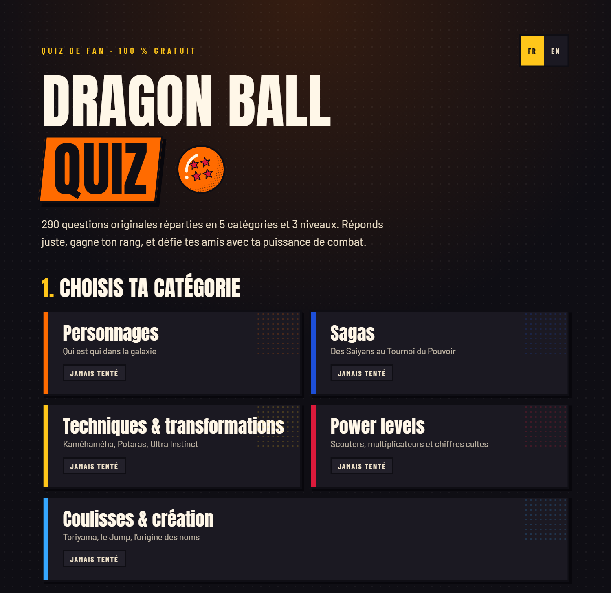
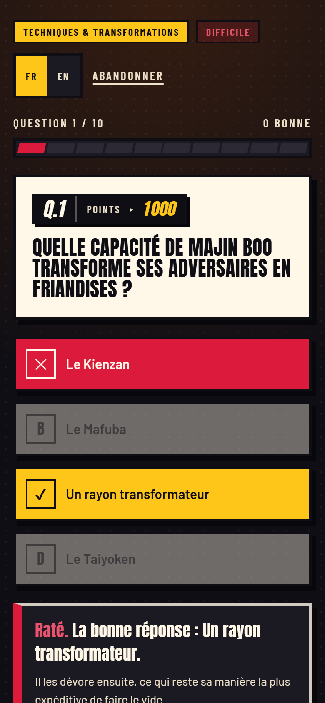
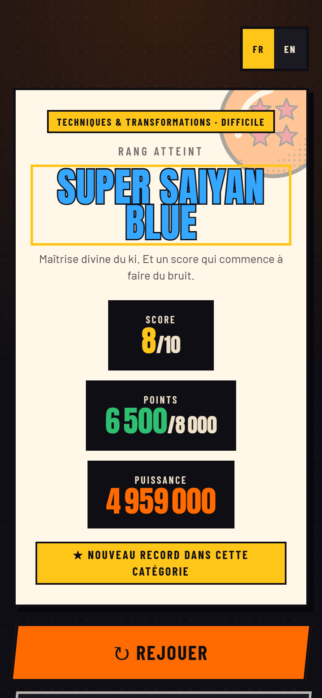

# dragonballquiz.com

Quiz de fan bilingue sur l'univers Dragon Ball. Site statique, React + Tailwind CSS,
sans backend : les meilleurs scores vivent dans le `localStorage` du visiteur.

**[dragonballquiz.com](https://dragonballquiz.com/)** · [English version](https://dragonballquiz.com/en/)

## Aperçu



| En partie | Fin de partie |
| --- | --- |
|  |  |

## Stack

- **React 19** (aucun routeur : une seule page, trois écrans pilotés par un état local)
- **Tailwind CSS v4** via `@tailwindcss/vite` — les tokens de design sont dans `src/index.css`
- **Vite 8** pour le build
- Aucune dépendance UI tierce

## Démarrer

```bash
npm install
npm run dev
```

| Script | Rôle |
| --- | --- |
| `npm run dev` | serveur de développement (port 5180) |
| `npm run build` | build de production dans `dist/` |
| `npm run preview` | sert le build de production en local |
| `npm run lint` | oxlint |
| `npm run check` | valide les deux banques, le barème, leur parité et celle des dictionnaires |
| `npm run check:fuites` | signale les explications qui citent la réponse d'une autre question |
| `npm run check:share` | affiche le texte de partage et les rangs, dans les deux langues |
| `node scripts/captures.mjs` | régénère les captures du README (voir l'en-tête du fichier) |

## Structure

```
src/
├── data/
│   ├── categories.js      identité et accent des 5 catégories
│   ├── questions.fr.js    290 questions, 5 catégories, 3 niveaux
│   └── questions.en.js    la même banque en anglais
├── lib/                   règles du jeu, rangs, barème, stockage, partage
├── i18n/                  dictionnaires fr / en + contexte de langue
├── hooks/                 compte à rebours, chargement de la banque
├── components/            écrans, blocs métier et primitives (ui/)
└── App.jsx                machine à états : accueil → quiz → résultat
```

## Ce qui mérite un coup d'œil

Le détail de chaque point est dans les **[notes techniques](docs/notes-techniques.md)**.

- **[Deux langues, deux URL](docs/notes-techniques.md#langues)** — et la langue du
  navigateur n'est jamais consultée : Googlebot explore en `Accept-Language: en`, et
  le rediriger empêcherait la version française d'être indexée.
- **[Un barème pondéré par difficulté](docs/notes-techniques.md#barème-pondéré)** —
  une bonne réponse vaut 300, 500 ou 1 000 points. À 5/10, le taux réel va de 38 % à
  63 % selon les questions tombées.
- **[La taille de la banque, calculée et non devinée](docs/notes-techniques.md#niveaux)** —
  le recouvrement entre deux manches suit `q²/p`. La formule prévoyait 3,14 ; la mesure
  a donné 3,18.
- **[Un harnais qui attrape ce qu'aucun test manuel ne verrait](docs/notes-techniques.md#ajouter-des-questions)** —
  parité des deux banques, parité des dictionnaires, et les explications qui livrent
  la réponse d'une autre question.
- **[Un mode chrono qui se met en pause](docs/notes-techniques.md#mode-chrono)** quand
  l'onglet passe en arrière-plan : perdre une question à cause d'une notification serait
  injuste.
- **[Un partage en trois paliers](docs/notes-techniques.md#partage-du-score)** — partage
  natif, sinon presse-papier, sinon champ pré-sélectionné.

## Déploiement

Chaque push sur `main` déclenche `.github/workflows/deploy.yml` : validation de la
banque de questions, lint, build, puis publication de `dist/` sur Pages. Il est aussi
déclenchable à la main (*Actions → Déploiement GitHub Pages → Run workflow*), sans
commit. **Aucun secret à configurer** : le workflow s'authentifie via OIDC.

Le domaine personnalisé, le repli sur un hébergement classique et les
enregistrements DNS sont détaillés dans les
[notes techniques](docs/notes-techniques.md#domaine-et-hébergement).

## Droits d'auteur

Site de fan non officiel, sans lien avec Toei Animation, Shueisha ou les ayants
droit d'Akira Toriyama. Dragon Ball et les noms qui en sont issus appartiennent à
leurs propriétaires respectifs.

Aucune image, aucun artwork, aucun logo ni aucune capture provenant de l'anime ou
du manga n'est utilisé. L'habillage graphique (palette, typographies, formes,
illustrations SVG) et l'intégralité des questions sont des créations originales
écrites pour ce site.
